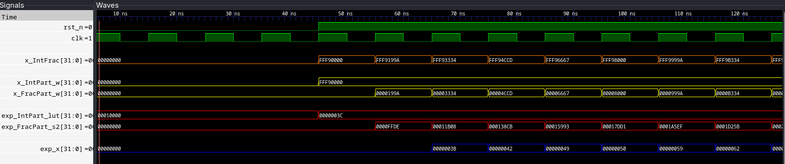

# Hardware Accelerator for Exponential Function

## 1. Architecture

Figure 1: Hardware accelerator architecture for the exponential function.

 
 

*<b>Stage 1: LUT and parallel Estrin terms</b>*
 

$$
    x\_{IntFrac} = x\_{IntPart} \quad + \quad x\_{FracPart}
$$

$$
    e^{x\_{IntPart}} = \text{LUT}(x\_{IntPart})
$$

$$
    term_0 = A_0 + A_1 \cdot {x_{FracPart}},\quad term_1 = {x_{FracPart}} \times {x_{FracPart}},\quad term_2 = A_2 + A_3 \cdot {x_{FracPart}}
$$

*<b>Stage 2: Combine fractional approximation</b>*

$$
    e^{x\_{FracPart}} = term_0 + term_1 \times term_2
$$

*<b>Stage 3: Final result</b>*

$$
    e^{x\_{IntFrac}} = e^{x\_{IntPart}} \times e^{x\_{FracPart}}
$$

## 2. Objectives

1. Design a hybrid architecture utilizing a LUT for $x_{\text{IntPart}}$ and a 3rd-degree Chebyshev polynomial for $x_{\text{FracPart}}$ to compute $e^{\pm x}$.
2. Numerical accuracy comparison between a 3rd-order Taylor series and a 3rd-order Chebyshev polynomial over $x \in [0, 1)$.
3. Apply Estrin's scheme, $e^x \approx (a_0 + a_1 x) + x^2(a_2 + a_3 x)$ to ensure parallel execution.
4. Implement a 3-stage pipelined architecture to compute $e^{x_{\text{IntPart}}}$ and $e^{x_{\text{FracPart}}}$ parallely.

## 3. Chebyshev Polynomials

An exponential function can be approximated using a polynomial,

$$
    e^x \approx a_0 + a_1x + a_2x^2 + a_3x^3 + \cdots
$$

Compared with the standard Taylor approximation, Chebyshev approximation provides better numerical accuracy over a finite interval.

Chebyshev approximation is generally defined over:

$$
t \in [-1,1]
$$

The function is represented by:

$$
e^t = \sum_{n=0}^{N} C_n T_n(t) \approx C_0T_0(t) + C_1T_1(t) + C_2T_2(t) + C_3T_3(t) + \cdots
$$

where:

$$
C_n = \text{Chebyshev coefficient}
$$

$$
T_n(t) = \text{Chebyshev polynomial of order } n
$$

### *<u>Step 1: Chebyshev Polynomials of the First Kind</u>*
Polynomials can be generated recursively using:

$$
T_0(t) = 1,
$$

$$
T_1(t) = t,
$$

and for $n \ge 2$,

$$
T_n(t) = 2tT_{n-1}(t) - T_{n-2}(t).
$$

Using this recurrence:

$$
T_2(t) = 2tT_1(t) - T_0(t) = 2t^2 - 1,
$$

$$
T_3(t) = 2tT_2(t) - T_1(t) = 4t^3 - 3t.
$$

### *<u>Step 2: Map approximation interval from [-1,1] to [0,1]</u>*
To map the Chebyshev variable $t\in[-1,1]$ to a normalized variable $x\in[0,1]$, linear transformation is used,

$$
t = a \cdot x + b
$$

When $t=-1$ at $x=0$:

$$
-1 = a\cdot 0 + b \quad\Rightarrow\quad b = -1.
$$

When $t=1$ at $x=1$:

$$
1 = a\cdot 1 + b \quad\Rightarrow\quad a + b = 1.
$$

Substituting $b=-1$ gives $a=2$, hence

$$
x = \frac{t+1}{2}, \qquad \text{so} \qquad t = 2x - 1.
$$

Therefore any Chebyshev polynomial in $t$ can be written as a function of $x$ by substituting $t=2x-1$.

Using this substitution, the first few Chebyshev polynomials become:

$$
T_0(2x-1) = 1,
$$

$$
T_1(2x-1) = 2x - 1,
$$

$$
T_2(2x-1) = 8x^2 - 8x + 1,
$$

$$
T_3(2x-1) = 32x^3 - 48x^2 + 18x - 1.
$$

### *<u>Step 3: Finding Chebyshev's nodes on [0,1]:</u>*
Chebyshev nodes are special points used to sample a function. They are chosen so that the approximation remains accurate throughout the interval and does not become inaccurate near the edges.

Chebyshev nodes on $[0,1]$ for $M$ sampling points are defined by mapping the standard Chebyshev points from $[-1,1]$ to $[0,1]$.

- $M$ is the total number of nodes; choosing a value larger than the polynomial degree $N$ ($M \gg N$) reduces coefficient error.
- $k$ is the node index, with $k = 0, 1, \ldots, M-1$.

$$
 t_k = \cos\left(\frac{(2k+1)\pi}{2M}\right), \qquad x_k = \frac{t_k + 1}{2} = \frac{1 + \cos\left(\frac{(2k+1)\pi}{2M}\right)}{2}.
$$

These mapped nodes cluster near $x=0$ and $x=1$, which reduces interpolation error on $[0,1]$.

### *<u>Step 4: Computing Chebyshev coefficients on [0,1]</u>*
Let $g(x_k)$ be a function on $[0,1]$ (for example $g(x_k)=e^{x_k}$). Sample $g(x_k)$ at the Chebyshev nodes $x_k\in[0,1]$,

For $n = 0$:

$$
C_0 = \frac{1}{M}\sum_{k=0}^{M-1} g(x_k),
$$

For $n\ge 1$:

$$
C_n = \frac{2}{M}\sum_{k=0}^{M-1} g(x_k)\,T_n(t_k),
$$

Here, $g(x_k) = e^{x_k}$ can be computed manually, and ${T_n}(t_k)$ can be calculated from **<u>Step 2</u>**, $T_n(2x_k-1)$.

The computed Chebyshev coefficients for $M = 64$ are:

| Coefficient | Value |
| :---: | ---: |
| $C_0$ | 1.7533876543770905 |
| $C_1$ | 0.8503916537808118 |
| $C_2$ | 0.1052086936309367 |
| $C_3$ | 0.0087221047333156 |

### *<u>Step 5: Finding the final equation:</u>*
Therefore, the cubic Chebyshev approximation is:
 
 

$$
e^x \approx \sum_{n=0}^{3} C_n T_n(2x-1) = C_0T_0(2x-1) + C_1T_1(2x-1) + C_2T_2(2x-1) + C_3T_3(2x-1)
$$

where,

$$
C_0 = 1.7533876544,\quad
C_1 = 0.8503916538,\quad
C_2 = 0.1052086936,\quad
C_3 = 0.0087221047
$$

$$
T_0(2x-1) = 1, \quad
T_1(2x-1) = 2x - 1,\quad
T_2(2x-1) = 8x^2 - 8x + 1,\quad
T_3(2x-1) = 32x^3 - 48x^2 + 18x - 1\quad
$$

Substituting these values, we obtain,
 

$$
e^x \approx
0.9994825895
+
1.0161116434x
+
0.4230085232x^2
+
0.2791073504x^3
$$

The resulting polynomial coefficients are:

| Coefficient | Value | Q16.16 |
| :---: | ---: | ---: |
| $a_0$ | 0.9994825895 | 65502 |
| $a_1$ | 1.0161116434 | 66592 |
| $a_2$ | 0.4230085232 | 27722 |
| $a_3$ | 0.2791073504 | 18292 |

Hence,
 

$$
    e^x \approx a_0 + a_1x + a_2x^2 + a_3x^3
$$

## 4. Estrin's Scheme

Estrin's scheme is an efficient way to evaluate polynomials in hardware by reducing the critical path and improving parallelism compared to Horner's method.

For the cubic polynomial $e^x \approx a_0 + a_1 x + a_2 x^2 + a_3 x^3$, Estrin's scheme organizes it as:

$$
e^x \approx (a_0 + a_1 x) + (x*x) * (a_2 + a_3 x).
$$

This requires two multiplications and parallel computation stages instead of cascading the operations sequentially.

Here,
 

$$
term_0 = a_0 + a_1 x,\quad
term_1 = x*x,\quad
term_2 = a_2+a_3x
$$

Please note that $a_1 x$ and $a_3 x$ can be synthesized simply by bit shifting, without any separate multipliers.

### <u>Example:</u>
To compute $(555*y)$ efficiently, decompose 555 as:

$$
555 = 2^9 + 2^5 + 2^3 + 2^1 + 2^0,
$$

then:

$$
555y = (y \ll 9) + (y \ll 5) + (y \ll 3) + (y \ll 1) + y,
$$

where $\ll$ denotes left bit shift. This avoids a full multiplier by using only addition and shifts.

## 5. Comparison: Chebyshev vs Taylor
### Taylor Series Expansion

The Taylor series for $e^x$ is:

$$
e^x \approx 1 + x + \frac{x^2}{2} + \frac{x^3}{6}
$$

The cubic Taylor polynomial coefficients are:

| Coefficient | Value | Q16.16 |
| :---: | ---: | ---: |
| $b_0$ | 1.0000000000 | 65536 |
| $b_1$ | 1.0000000000 | 65536 |
| $b_2$ | 0.5000000000 | 32768 |
| $b_3$ | 0.1666666667 | 10923 |

### Chebyshev Series Coefficients

For comparison, the cubic Chebyshev approximation on $[0,1]$ uses:

| Coefficient | Value | Q16.16 |
| :---: | ---: | ---: |
| $a_0$ | 0.9994825895 | 65502 |
| $a_1$ | 1.0161116434 | 66592 |
| $a_2$ | 0.4230085232 | 27722 |
| $a_3$ | 0.2791073504 | 18292 |

### Error Analysis:
In order to compare, test stimulus are given for $x\_{IntFrac} \in [0,1)$ 

| x | Expected | Chebyshev | Cheb. Error (%) | Taylor | Taylor Error (%) |
|---:|---:|---:|---:|---:|---:|
| 0.00 | 1.000000 | 0.999481 | 0.05188 | 1.000000 | 0.00000 |
| 0.05 | 1.051271 | 1.051346 | 0.00711 | 1.051239 | 0.00305 |
| 0.10 | 1.105171 | 1.105576 | 0.03661 | 1.105148 | 0.00205 |
| 0.15 | 1.161834 | 1.162338 | 0.04338 | 1.161789 | 0.00390 |
| 0.20 | 1.221403 | 1.221832 | 0.03517 | 1.221313 | 0.00731 |
| 0.25 | 1.284025 | 1.284302 | 0.02152 | 1.283844 | 0.01413 |
| 0.30 | 1.349859 | 1.349884 | 0.00187 | 1.349472 | 0.02865 |
| 0.35 | 1.419068 | 1.418869 | 0.01399 | 1.418365 | 0.04947 |
| 0.40 | 1.491825 | 1.491440 | 0.02580 | 1.490646 | 0.07899 |
| 0.45 | 1.568312 | 1.567795 | 0.03299 | 1.566422 | 0.12055 |
| 0.50 | 1.648721 | 1.648132 | 0.03572 | 1.645798 | 0.17732 |
| 0.55 | 1.733253 | 1.732697 | 0.03211 | 1.728943 | 0.24867 |
| 0.60 | 1.822119 | 1.821686 | 0.02376 | 1.815964 | 0.33780 |
| 0.65 | 1.915541 | 1.915298 | 0.01265 | 1.906998 | 0.44599 |
| 0.70 | 2.013753 | 2.013748 | 0.00023 | 2.002151 | 0.57610 |
| 0.75 | 2.117000 | 2.117249 | 0.01174 | 2.101562 | 0.72922 |
| 0.80 | 2.225541 | 2.225937 | 0.01779 | 2.205292 | 0.90985 |
| 0.85 | 2.339647 | 2.340164 | 0.02211 | 2.313568 | 1.11464 |
| 0.90 | 2.459603 | 2.460052 | 0.01827 | 2.426468 | 1.34718 |
| 0.95 | 2.585710 | 2.585815 | 0.00409 | 2.544113 | 1.60871 |

### Performance Matrices:

| Metric | Chebyshev | Taylor |
|---|---:|---:|
| **RMSE** | 3.88001 × 10⁻⁴ | 2.2568 × 10⁻² |
| **MAE** | 3.43850 × 10⁻⁴ | 1.4196 × 10⁻² |
| **MAPE** | 0.02244% | 0.39018% |
| **Maximum Absolute Error** | 5.89 × 10⁻⁴ | 4.1597 × 10⁻² |
| **Maximum Percentage Error** | 0.051880% | 1.608707% |
| **R² Score** | 0.9999993442 | 0.99749 |

## 6. Waveform

 

Figure 2: Waveform output.

## 7. Run Commands

``$ verilator --version`` 
``Verilator 5.046``

### run.sh:
#! /bin/bash

verilator -sv -Irtl --cc tb/tb_exp_rtl.sv --exe sim_main.cpp --build --timing --Wno-fatal --Wno-UNOPTFLAT --Wno-WIDTH --Wno-TIMESCALEMOD --trace

./obj_dir/Vtb_exp_rtl

